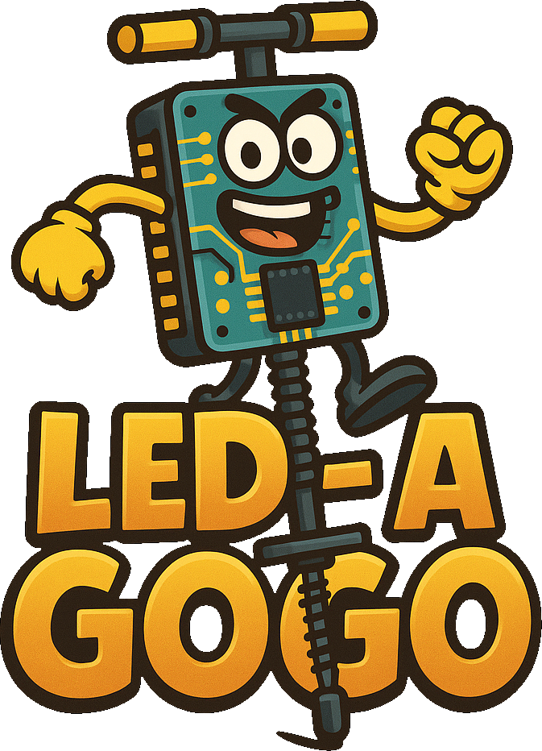
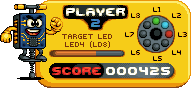

     project" width="225"/>
    

        
        
    

# 📟 LED-A-Gogo - APC Course Project - A.A. 2024/2025
**Academic Year:** 2024/2025  
**Course Instructor:** Professor Nicola Mazzocca  
**University:** University of Naples Federico II (UNINA)  
**Degree Program:** Master’s Degree in Computer Engineering (*Ingegneria Informatica*)

<u><b>Developed by:</b></u>  
Emmanuele Marino  
Livia Pagliaro  
Martina Capasso  

---

## ⚠️ Disclaimer
This project was developed in the context of a universitary exam.  
For this very reason, some compromises and workarounds had to be made with regards to certain software design choices (in order, primarily, to be able to deliver the project in time).  
This repository "crystalizes" the state of the project at the time it was completed and submitted to the professor.  
With that said, I have the intention to keep on working on it as a passion project, in the future.  
If said plans were to be realized, a fork of this repository will be created for further development.

---

## 📝 Brief description
This project's aim is the development of a simple game loosely inspired by the "**Pogo-A-Gogo**" minigame from Crash Bash, where STM32F3DISCOVERY boards are used as controllers.

In further detail, the readings of angular velocity coming from the "**L3GD20**" gyroscope (which is mounted on the board and communicates with the microcontroller via the **SPI protocol**) will be transmitted to the game process using:

* A "**HC-05**" Bluetooth module for the first player's board.
* A USB connection for the other players (testing was conducted with *two boards* which used the serial capabilities of the **ST-LINK** port of the board, and one board which was connected to the computer via a **FT232RL** USB-to-serial adapter).

Said readings will be then used to control the position on the screen of the player associated with the singular board.

---

## 🟢🔵🔴🟠 Turn the LEDs on! 🟢🔵🔴🟠

    

    To increment its score, a player must <b><i>close a rectangle</i></b>
    of <b>3x3</b> or greater size on the <b><i>8x8 "pogo board"</i></b>. 
    Each time a player's score exceeds a certain <b>threshold</b>,
    a LED is <b><i>physically turned on</i></b> on the STM32F3DISCOVERY board. 
    The game ends when a player has managed to turn on
    every LED or when the game session's time expires. 
    The player who's turned on every LED, or whose score
    was the highest when the time expired, wins the game.
    

---

## ⚡ Speed up!

From time to time, a "power up" icon can spawn on the "pogo board".  
Once a player collects a power up, said player possesses a limited amount of time to **consume** the power up by pressing the **USER button** on the board.  
The effect of the power up's consumption is an increase of the player's speed for a brief period of time.

---

## 💡 Regarding the Python requirements
During the project's development, the dependencies listed in the "**requirements.txt**" file were installed within a **_virtual environment_**: this is the recommended approach, as it helps prevent potential conflicts with globally installed Python packages.