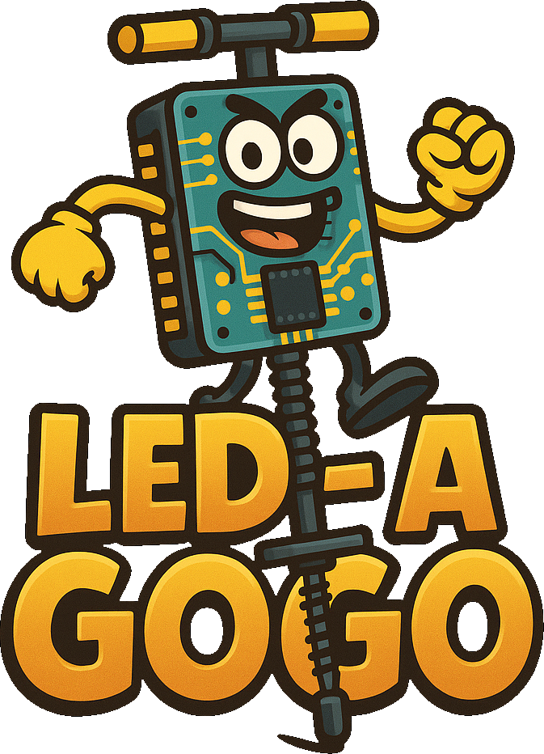

 project" width="250" />

# 📟 LED-A-Gogo - APC Course Project - A.A. 2024/2025
**Academic Year:** 2024/2025  
**Course Instructor:** Professor Nicola Mazzocca  
**University:** University of Naples Federico II (UNINA)  
**Degree Program:** Master’s Degree in Computer Science  

---

## 📝 Project Description
This project's aim is the development of a simple game loosely inspired by the "**Pogo-A-Gogo**" minigame from Crash Bash, where STM32F3DISCOVERY boards are used as controllers.

In further detail, the readings of angular velocity coming from the "**L3GD20**" gyroscope (which is mounted on the board and communicates with the microcontroller via the **SPI protocol**) will be transmitted to the game process using a "**HC-05**" Bluetooth module for each board; then, said readings will be used to control the position on the screen of the player associated with the singular board.

---

## 💡 Regarding the Python requirements
During the project's development, the dependencies listed in the "**requirements.txt**" file were installed within a **_virtual environment_**: this is the recommended approach, as it helps prevent potential conflicts with globally installed Python packages.